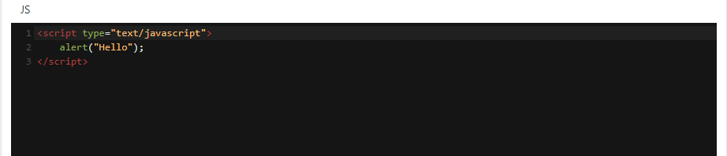
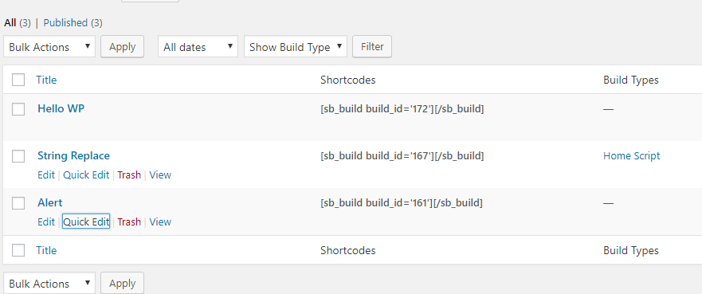

# Scratch Builder
Build something from scratch using js,css and html inside wp-admin!Use on every page,post or custom post type.


## Your Editors





## Usage 1:

Regular shortcode display:

```
[sb_build build_id='172']
```

## Usage 2:

Using Enclosing Shortcodes

```
[sb_build build_id='172']content to manipulate[/sb_build]
```
Be sure to use %s where you want your content to appear.


## Organize your codes

Add a Category for each build


Quick grab your shortcode right in the Dashboard!

